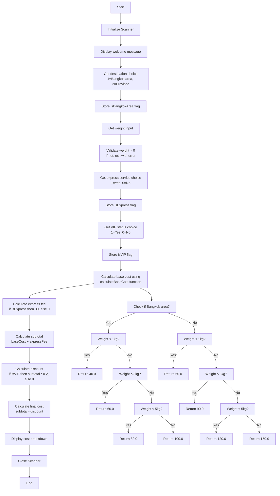

# Shipping Calculator Flowchart and Pseudocode

## Flowchart



## Pseudocode

```
BEGIN ShippingCalculator

    // Define pricing constants
    CONSTANT BANGKOK_WEIGHT_0_1_KG = 40.0
    CONSTANT BANGKOK_WEIGHT_1_3_KG = 60.0
    CONSTANT BANGKOK_WEIGHT_3_5_KG = 80.0
    CONSTANT BANGKOK_WEIGHT_ABOVE_5_KG = 100.0
    
    CONSTANT PROVINCE_WEIGHT_0_1_KG = 60.0
    CONSTANT PROVINCE_WEIGHT_1_3_KG = 90.0
    CONSTANT PROVINCE_WEIGHT_3_5_KG = 120.0
    CONSTANT PROVINCE_WEIGHT_ABOVE_5_KG = 150.0
    
    CONSTANT EXPRESS_SERVICE_FEE = 30.0
    CONSTANT VIP_DISCOUNT_RATE = 0.20

    MAIN()
        CREATE Scanner object
        
        DISPLAY "=== ระบบคำนวณค่าจัดส่งสินค้า ==="
        
        DISPLAY "เลือกปลายทาง:"
        DISPLAY "1. กรุงเทพฯ และปริมณฑล"
        DISPLAY "2. ต่างจังหวัด"
        INPUT destinationChoice
        
        SET isBangkokArea = (destinationChoice == 1)
        
        INPUT weight
        
        IF weight <= 0 THEN
            DISPLAY "น้ำหนักต้องมากกว่า 0"
            CLOSE scanner
            EXIT
        END IF
        
        INPUT expressChoice
        SET isExpress = (expressChoice == 1)
        
        INPUT vipChoice
        SET isVIP = (vipChoice == 1)
        
        SET baseCost = calculateBaseCost(isBangkokArea, weight)
        SET expressFee = IF isExpress THEN EXPRESS_SERVICE_FEE ELSE 0
        SET subtotal = baseCost + expressFee
        SET discount = IF isVIP THEN (subtotal * VIP_DISCOUNT_RATE) ELSE 0
        SET finalCost = subtotal - discount
        
        DISPLAY "=== สรุปค่าจัดส่ง ==="
        DISPLAY "ปลายทาง: " + IF isBangkokArea THEN "กรุงเทพฯ และปริมณฑล" ELSE "ต่างจังหวัด"
        DISPLAY "น้ำหนัก: " + weight + " กิโลกรัม"
        DISPLAY "ค่าขนส่งพื้นฐาน: " + FORMAT(baseCost) + " บาท"
        
        IF isExpress THEN
            DISPLAY "ค่าบริการด่วน: " + FORMAT(expressFee) + " บาท"
        END IF
        
        DISPLAY "รวมเป็นเงิน: " + FORMAT(subtotal) + " บาท"
        
        IF isVIP THEN
            DISPLAY "ส่วนลดสมาชิก VIP (20%): " + FORMAT(discount) + " บาท"
        END IF
        
        DISPLAY "ยอดชำระสุทธิ: " + FORMAT(finalCost) + " บาท"
        
        CLOSE scanner
    END MAIN

    FUNCTION calculateBaseCost(isBangkokArea, weight)
        IF isBangkokArea THEN
            IF weight <= 1 THEN
                RETURN BANGKOK_WEIGHT_0_1_KG
            ELSE IF weight <= 3 THEN
                RETURN BANGKOK_WEIGHT_1_3_KG
            ELSE IF weight <= 5 THEN
                RETURN BANGKOK_WEIGHT_3_5_KG
            ELSE
                RETURN BANGKOK_WEIGHT_ABOVE_5_KG
            END IF
        ELSE
            IF weight <= 1 THEN
                RETURN PROVINCE_WEIGHT_0_1_KG
            ELSE IF weight <= 3 THEN
                RETURN PROVINCE_WEIGHT_1_3_KG
            ELSE IF weight <= 5 THEN
                RETURN PROVINCE_WEIGHT_3_5_KG
            ELSE
                RETURN PROVINCE_WEIGHT_ABOVE_5_KG
            END IF
        END IF
    END FUNCTION

END ShippingCalculator
```