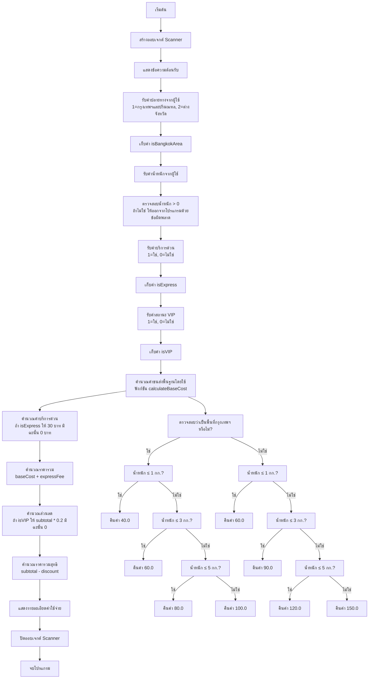

# ผังงานและรหัสเทียมของโปรแกรมคำนวณค่าจัดส่ง

## ผังงาน (Flowchart)



## รหัสเทียม (Pseudocode)

```
BEGIN โปรแกรมคำนวณค่าจัดส่ง

    // กำหนดค่าคงที่สำหรับราคา
    CONSTANT ราคากรุงเทพ_น้ำหนัก_0_1_กก = 40.0
    CONSTANT ราคากรุงเทพ_น้ำหนัก_1_3_กก = 60.0
    CONSTANT ราคากรุงเทพ_น้ำหนัก_3_5_กก = 80.0
    CONSTANT ราคากรุงเทพ_น้ำหนัก_มากกว่า_5_กก = 100.0
    
    CONSTANT ราคาต่างจังหวัด_น้ำหนัก_0_1_กก = 60.0
    CONSTANT ราคาต่างจังหวัด_น้ำหนัก_1_3_กก = 90.0
    CONSTANT ราคาต่างจังหวัด_น้ำหนัก_3_5_กก = 120.0
    CONSTANT ราคาต่างจังหวัด_น้ำหนัก_มากกว่า_5_กก = 150.0
    
    CONSTANT ค่าบริการด่วน = 30.0
    CONSTANT อัตราส่วนลดVIP = 0.20

    MAIN()
        สร้างออบเจกต์ Scanner
        
        แสดงผล "=== ระบบคำนวณค่าจัดส่งสินค้า ==="
        
        แสดงผล "เลือกปลายทาง:"
        แสดงผล "1. กรุงเทพฯ และปริมณฑล"
        แสดงผล "2. ต่างจังหวัด"
        รับค่าตัวแปร ตัวเลือกปลายทาง
        
        กำหนดค่า อยู่ในเขตกรุงเทพ = (ตัวเลือกปลายทาง == 1)
        
        รับค่า น้ำหนัก
        
        ถ้า น้ำหนัก <= 0 แล้ว
            แสดงผล "น้ำหนักต้องมากกว่า 0"
            ปิดออบเจกต์ Scanner
            ออกจากโปรแกรม
        จบถ้า
        
        รับค่า ตัวเลือกบริการด่วน
        กำหนดค่า ใช้บริการด่วน = (ตัวเลือกบริการด่วน == 1)
        
        รับค่า ตัวเลือกVIP
        กำหนดค่า เป็นVIP = (ตัวเลือกVIP == 1)
        
        กำหนดค่า ต้นทุนพื้นฐาน = คำนวณต้นทุนพื้นฐาน(อยู่ในเขตกรุงเทพ, น้ำหนัก)
        กำหนดค่า ค่าบริการด่วน = ถ้า ใช้บริการด่วน ให้ ค่าบริการด่วน มิฉะนั้น 0
        กำหนดค่า ราคารวม = ต้นทุนพื้นฐาน + ค่าบริการด่วน
        กำหนดค่า ส่วนลด = ถ้า เป็นVIP ให้ (ราคารวม * อัตราส่วนลดVIP) มิฉะนั้น 0
        กำหนดค่า ราคารวมสุทธิ = ราคารวม - ส่วนลด
        
        แสดงผล "=== สรุปค่าจัดส่ง ==="
        แสดงผล "ปลายทาง: " + ถ้า อยู่ในเขตกรุงเทพ ให้ "กรุงเทพฯ และปริมณฑล" มิฉะนั้น "ต่างจังหวัด"
        แสดงผล "น้ำหนัก: " + น้ำหนัก + " กิโลกรัม"
        แสดงผล "ค่าขนส่งพื้นฐาน: " + จัดรูปแบบ(ต้นทุนพื้นฐาน) + " บาท"
        
        ถ้า ใช้บริการด่วน แล้ว
            แสดงผล "ค่าบริการด่วน: " + จัดรูปแบบ(ค่าบริการด่วน) + " บาท"
        จบถ้า
        
        แสดงผล "รวมเป็นเงิน: " + จัดรูปแบบ(ราคารวม) + " บาท"
        
        ถ้า เป็นVIP แล้ว
            แสดงผล "ส่วนลดสมาชิก VIP (20%): " + จัดรูปแบบ(ส่วนลด) + " บาท"
        จบถ้า
        
        แสดงผล "ยอดชำระสุทธิ: " + จัดรูปแบบ(ราคารวมสุทธิ) + " บาท"
        
        ปิดออบเจกต์ Scanner
    END MAIN

    ฟังก์ชัน คำนวณต้นทุนพื้นฐาน(อยู่ในเขตกรุงเทพ, น้ำหนัก)
        ถ้า อยู่ในเขตกรุงเทพ แล้ว
            ถ้า น้ำหนัก <= 1 แล้ว
                คืนค่า ราคากรุงเทพ_น้ำหนัก_0_1_กก
            นอกนั้นถ้า น้ำหนัก <= 3 แล้ว
                คืนค่า ราคากรุงเทพ_น้ำหนัก_1_3_กก
            นอกนั้นถ้า น้ำหนัก <= 5 แล้ว
                คืนค่า ราคากรุงเทพ_น้ำหนัก_3_5_กก
            นอกนั้น
                คืนค่า ราคากรุงเทพ_น้ำหนัก_มากกว่า_5_กก
            จบถ้า
        นอกนั้น
            ถ้า น้ำหนัก <= 1 แล้ว
                คืนค่า ราคาต่างจังหวัด_น้ำหนัก_0_1_กก
            นอกนั้นถ้า น้ำหนัก <= 3 แล้ว
                คืนค่า ราคาต่างจังหวัด_น้ำหนัก_1_3_กก
            นอกนั้นถ้า น้ำหนัก <= 5 แล้ว
                คืนค่า ราคาต่างจังหวัด_น้ำหนัก_3_5_กก
            นอกนั้น
                คืนค่า ราคาต่างจังหวัด_น้ำหนัก_มากกว่า_5_กก
            จบถ้า
        จบถ้า
    END ฟังก์ชัน

END โปรแกรมคำนวณค่าจัดส่ง
```